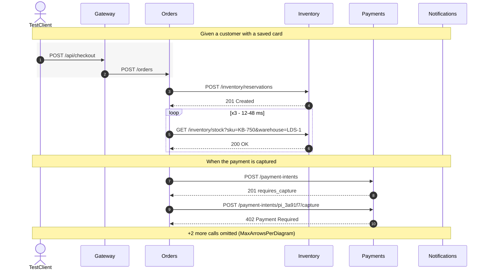
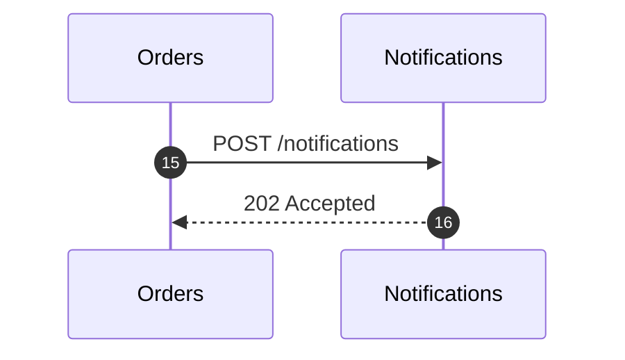
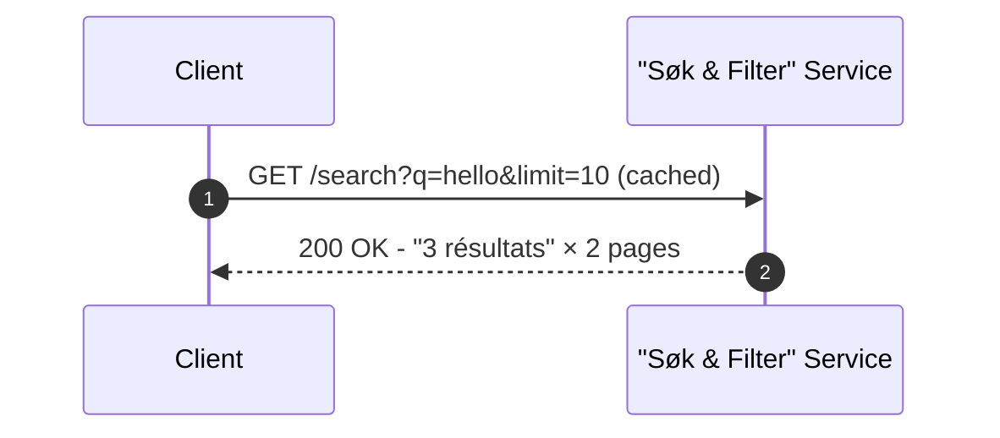
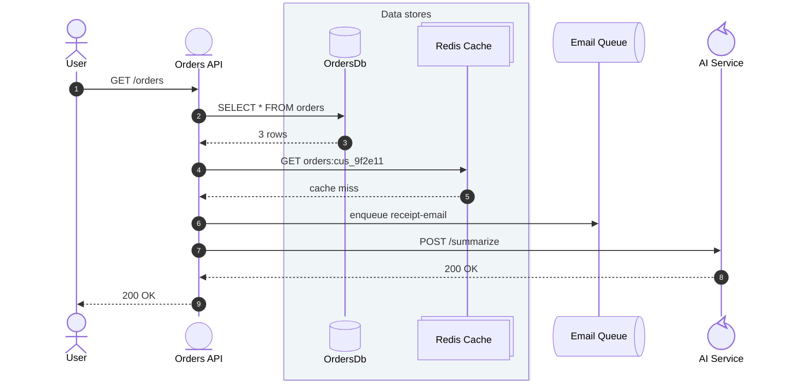

# Diagrammed Test Run Summary

> **V4 spike (Phase 0a)** — hand-written sample of the planned v4 CI summary format.
> Each PROBE below verifies one rendering assumption from V4_PLAN.md. Eyeball pass/fail per probe.

| Metric | Value |
|---|---|
| Status | ❌ Failed |
| Scenarios | 12 |
| Passed | 10 |
| Failed | 1 |
| Skipped | 1 |
| Duration | 1m 42s |

## PROBE 1 — mermaid fence renders in a step summary, with `autonumber`, `rect`, `loop`, `Note over`

## ❌ Failed Scenarios (1)

<details open><summary>❌ <strong>Orders — Checkout reserves stock and captures payment</strong></summary>

**Error:** Expected status 201 Created but got 402 Payment Required

<details open><summary>Stack Trace</summary>

```
   at Orders.Tests.CheckoutTests.Checkout_reserves_stock_and_captures_payment() in C:\src\Orders.Tests\CheckoutTests.cs:line 42
   at System.RuntimeMethodHandle.InvokeMethod(Object target, Void** arguments, Signature sig, Boolean isConstructor)
```

</details>



## PROBE 2 — numbered payload legend: `<details>` + ```json fences, one pre-opened

### Payloads

<details><summary><strong>1</strong> TestClient → Gateway · POST /api/checkout</summary>

```json
{
  "customerId": "cus_9f2e11",
  "items": [
    { "sku": "KB-750", "name": "Keychron K750", "qty": 1, "unitPrice": 12900 },
    { "sku": "MSE-210", "name": "MX Silent 210", "qty": 2, "unitPrice": 2450 }
  ],
  "payment": { "method": "card", "token": "tok_v1_8c1d4a" }
}
```

</details>
<details><summary><strong>3</strong> Orders → Inventory · POST /inventory/reservations</summary>

```json
{
  "orderRef": "ord_pending_5k21",
  "ttlSeconds": 900,
  "lines": [
    { "sku": "KB-750", "qty": 1, "warehouseHint": "LDS-1" },
    { "sku": "MSE-210", "qty": 2, "warehouseHint": "LDS-1" }
  ]
}
```

</details>
<details open><summary><strong>10</strong> Payments → Orders · 402 Payment Required ⬅ failure</summary>

```json
{
  "intentId": "pi_3a91f7",
  "status": "requires_payment_method",
  "error": {
    "code": "card_declined",
    "declineCode": "insufficient_funds",
    "message": "Your card has insufficient funds."
  }
}
```

</details>

## PROBE 3 — non-JSON payload (bare fence) and a payload containing triple backticks (four-backtick fence)

<details><summary><strong>4</strong> Inventory → Orders · 201 Created (plain-text body)</summary>

```
reservation accepted
expires: 2026-08-30T11:57:33Z
```

</details>
<details><summary><strong>5</strong> Orders → Docs · POST /render (body contains a code fence)</summary>

````json
{
  "template": "readme",
  "body": "usage:\n```\nkronikol export --otlp\n```\ndone"
}
````

</details>

## PROBE 4 — autonumber continuation across parts (`autonumber 15`)

Part 2 of a split diagram must continue numbering at 15:



If the two arrows above show **15** and **16**, continuation works.

## PROBE 5 — label edge characters (query strings, parens, quotes, unicode)



## PROBE 6 — size ceiling (~120 arrows, 6 participants)

A deliberately large single diagram to find where GitHub's mermaid renderer refuses (`maxTextSize` / edge limits). If this renders, the per-part arrow cap can be generous; if it errors, note the error text.

```mermaid
sequenceDiagram
    autonumber
    participant C
    participant G
    participant O
    participant I
    participant P
    participant N
    C->>G: POST /api/step-0
    G-->>C: 200 OK step-0
    C->>G: POST /api/step-1
    G-->>C: 200 OK step-1
    C->>G: POST /api/step-2
    G-->>C: 200 OK step-2
    C->>G: POST /api/step-3
    G-->>C: 200 OK step-3
    C->>G: POST /api/step-4
    G-->>C: 200 OK step-4
    C->>G: POST /api/step-5
    G-->>C: 200 OK step-5
    C->>G: POST /api/step-6
    G-->>C: 200 OK step-6
    C->>G: POST /api/step-7
    G-->>C: 200 OK step-7
    C->>G: POST /api/step-8
    G-->>C: 200 OK step-8
    C->>G: POST /api/step-9
    G-->>C: 200 OK step-9
    C->>G: POST /api/step-10
    G-->>C: 200 OK step-10
    C->>G: POST /api/step-11
    G-->>C: 200 OK step-11
    C->>G: POST /api/step-12
    G-->>C: 200 OK step-12
    C->>G: POST /api/step-13
    G-->>C: 200 OK step-13
    C->>G: POST /api/step-14
    G-->>C: 200 OK step-14
    C->>G: POST /api/step-15
    G-->>C: 200 OK step-15
    C->>G: POST /api/step-16
    G-->>C: 200 OK step-16
    C->>G: POST /api/step-17
    G-->>C: 200 OK step-17
    C->>G: POST /api/step-18
    G-->>C: 200 OK step-18
    C->>G: POST /api/step-19
    G-->>C: 200 OK step-19
    C->>G: POST /api/step-20
    G-->>C: 200 OK step-20
    C->>G: POST /api/step-21
    G-->>C: 200 OK step-21
    C->>G: POST /api/step-22
    G-->>C: 200 OK step-22
    C->>G: POST /api/step-23
    G-->>C: 200 OK step-23
    C->>G: POST /api/step-24
    G-->>C: 200 OK step-24
    C->>G: POST /api/step-25
    G-->>C: 200 OK step-25
    C->>G: POST /api/step-26
    G-->>C: 200 OK step-26
    C->>G: POST /api/step-27
    G-->>C: 200 OK step-27
    C->>G: POST /api/step-28
    G-->>C: 200 OK step-28
    C->>G: POST /api/step-29
    G-->>C: 200 OK step-29
    C->>G: POST /api/step-30
    G-->>C: 200 OK step-30
    C->>G: POST /api/step-31
    G-->>C: 200 OK step-31
    C->>G: POST /api/step-32
    G-->>C: 200 OK step-32
    C->>G: POST /api/step-33
    G-->>C: 200 OK step-33
    C->>G: POST /api/step-34
    G-->>C: 200 OK step-34
    C->>G: POST /api/step-35
    G-->>C: 200 OK step-35
    C->>G: POST /api/step-36
    G-->>C: 200 OK step-36
    C->>G: POST /api/step-37
    G-->>C: 200 OK step-37
    C->>G: POST /api/step-38
    G-->>C: 200 OK step-38
    C->>G: POST /api/step-39
    G-->>C: 200 OK step-39
    C->>G: POST /api/step-40
    G-->>C: 200 OK step-40
    C->>G: POST /api/step-41
    G-->>C: 200 OK step-41
    C->>G: POST /api/step-42
    G-->>C: 200 OK step-42
    C->>G: POST /api/step-43
    G-->>C: 200 OK step-43
    C->>G: POST /api/step-44
    G-->>C: 200 OK step-44
    C->>G: POST /api/step-45
    G-->>C: 200 OK step-45
    C->>G: POST /api/step-46
    G-->>C: 200 OK step-46
    C->>G: POST /api/step-47
    G-->>C: 200 OK step-47
    C->>G: POST /api/step-48
    G-->>C: 200 OK step-48
    C->>G: POST /api/step-49
    G-->>C: 200 OK step-49
    C->>G: POST /api/step-50
    G-->>C: 200 OK step-50
    C->>G: POST /api/step-51
    G-->>C: 200 OK step-51
    C->>G: POST /api/step-52
    G-->>C: 200 OK step-52
    C->>G: POST /api/step-53
    G-->>C: 200 OK step-53
    C->>G: POST /api/step-54
    G-->>C: 200 OK step-54
    C->>G: POST /api/step-55
    G-->>C: 200 OK step-55
    C->>G: POST /api/step-56
    G-->>C: 200 OK step-56
    C->>G: POST /api/step-57
    G-->>C: 200 OK step-57
    C->>G: POST /api/step-58
    G-->>C: 200 OK step-58
    C->>G: POST /api/step-59
    G-->>C: 200 OK step-59
```



## PROBE 7 — typed participants (mermaid `@{ "type": ... }` syntax) + box grouping

Kronikol's PlantUML shapes map 1:1 onto mermaid's typed participants (entity/database/collections/queue/control + actor). This probe tells us whether GitHub's pinned mermaid version supports the syntax. **If this shows a syntax-error box, GitHub's mermaid is too old and the emitter falls back to plain participants.**



Expected: stickman for User, distinct symbols for entity/database/collections/queue/control, and a tinted box around the two data stores.

*End of spike. Compare each probe against V4_PLAN.md Phase 1 assumptions.*
